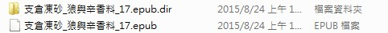
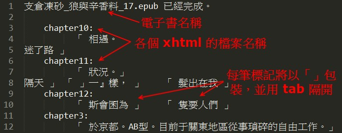

# Kindle Duokan Bookmark Parser：
### 將多看系統於 epub 上的 書籤 / 書摘批註 整理並輸出成文字檔
 

---

#### 語言：Python 3
#### 需要安裝 module：
* lxml （Windows 可於 [這裡](http://www.lfd.uci.edu/~gohlke/pythonlibs/#lxml) 下載對應的 whl 檔後，以 pip 安裝。）

---

#### 使用方法：
* 多看會對每本 epub 建立對應的 .dir 檔案，如下圖
* 將 .dir 下的 dkx 檔，直接拖曳到 BookmarkParser.py 上即可
* p.s. 可以一次拖曳多個檔案，且其檔名不影響程式運行

---

#### 結果預覽：

 
